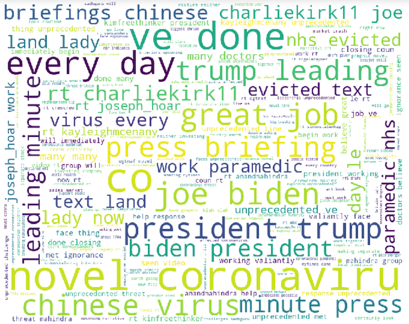

# Coronavirus
ETL of live tweets about COVID-19/Coronavirus along with sentiment analysis. I've used Python to pipeline tweets into two different MySQL tables: one captures tweets featuring keywords "coronavirus" and "COVID-19", and the other captures keywords "novel" and "unprecedented."

After 36 hours of open pipeline, nearly 6 million tweets have been captured in the first category. After 16 hours, about 180,000 tweets have been captured in the second.

# Word Clouds

## novel, unprecedented

## coronavirus, COVID-19

